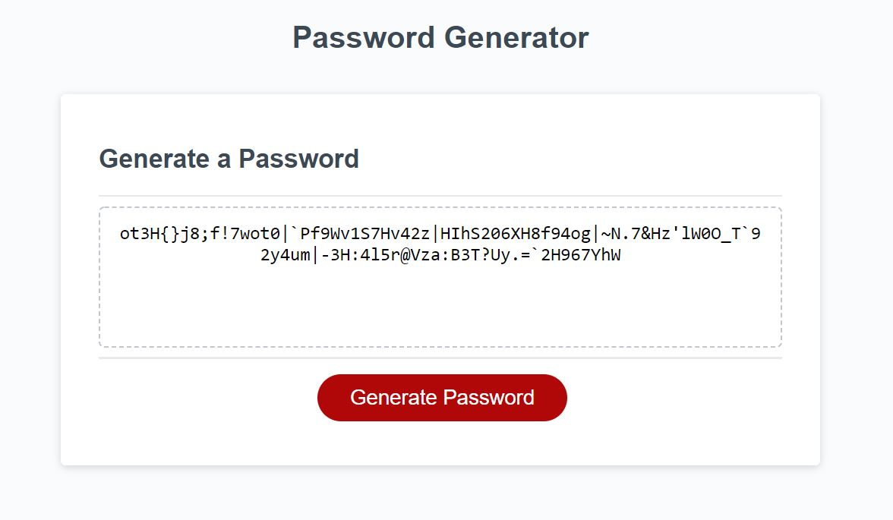

# Password Generator

Task was to create a password generator that prompts the user for how they want the password to be built.
I.e. asks length of the password and the character types (upper, lower, numeric and special). Then with the user's input, the password is generated by iterating through the specified password length and based on the selected character types, a character is selected randomly and appended to the password. On completion of the iteration the password is displayed in the box.

Link: https://eikohler.github.io/Password-Generator/

